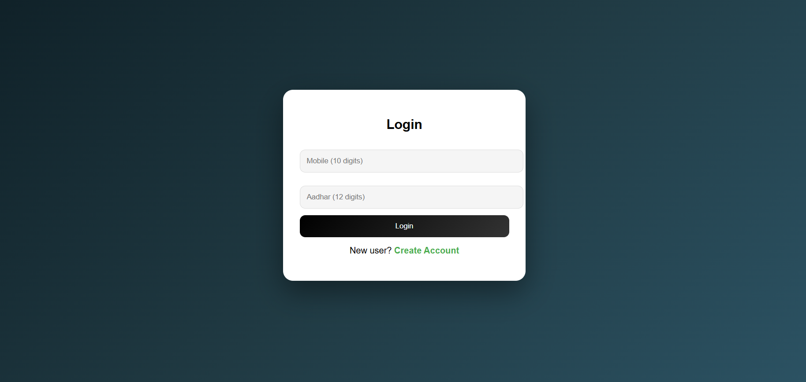
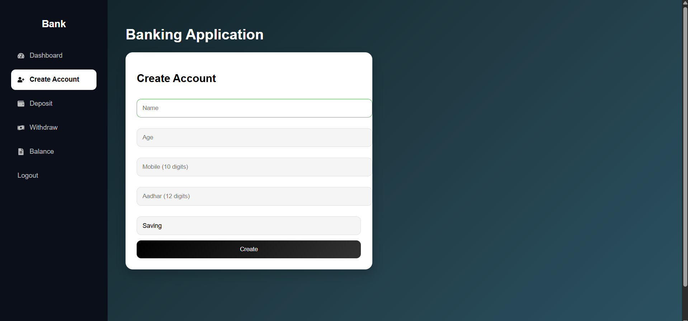

# 💳 Banking Management Dashboard (Full Stack)

A full-stack banking web application built using **React (frontend)** and **Python Flask + MySQL (backend)**.
This project simulates real-world banking operations with a clean dashboard UI.

---

## 🚀 Live Demo

Frontend (Vercel):
https://bank-management-dashboard-mh0ykl7z5.vercel.app

Backend (Render):
https://bank-management-dashboard-dxy9.onrender.com

---

## ✨ Features

* 🔐 Login using Mobile & Aadhar
* 🏦 Create Bank Account
* 💰 Deposit Money
* 💸 Withdraw Money
* 📊 Check Account Balance
* 📜 Transaction History
* 📈 Dashboard with summary cards
* 📉 Transaction chart (Recharts)
* ⚡ Loading states
* 🔒 Duplicate request prevention
* ✅ Input validations (Age, Mobile, Aadhar)

---

## 🛠️ Tech Stack

### Frontend

* React.js
* CSS (Custom UI)
* Recharts
* Fetch API

### Backend

* Python (Flask)
* MySQL
* Flask-CORS
* Gunicorn

---

## 📂 Project Structure

bank-management-dashboard/
│
├── backend/
│   ├── app.py
│   ├── bank.py
│   ├── db.py
│   ├── login.py
│   ├── requirements.txt
│
├── frontend/
│   ├── public/
│   ├── src/
│   │   ├── App.js
│   │   ├── Balance.js
│   │   ├── CreateAccount.js
│   │   ├── Dashboard.js
│   │   ├── Deposit.js
│   │   ├── Withdraw.js
│   │   ├── Login.js
│   │   ├── index.js
│   │   ├── App.css
│   │   │
│   │   └── screenshots/
│   │       ├── Dashboard.png
│   │       └── Home.png
│   │
│   ├── package.json
│
├── README.md

---

## ⚙️ How to Run Locally

### 1️⃣ Clone Repository

git clone https://github.com/amulyabashetty-source/bank-management-dashboard.git
cd bank-management-dashboard

---

### 2️⃣ Backend Setup

cd backend
python -m venv venv

Activate:

Windows:
venv\Scripts\activate

Install:

pip install -r requirements.txt

Run:

python app.py

Server runs at:
http://127.0.0.1:5000

---

### 3️⃣ Frontend Setup

cd frontend
npm install
npm start

App runs at:
http://localhost:3000

---

## 🔌 API Endpoints

* POST /login
* POST /create-account
* POST /deposit
* POST /withdraw
* GET /balance/<account_number>
* GET /transactions/<account_number>

---

## ⚠️ Important Notes

* Backend is hosted on free tier (Render)
* It may take **10–30 seconds to wake up**
* First request may show delay or error

---

## 📸 Screenshots

### 🔐 Login Page

---

### 📊 Dashboard (Home Page)

---

## 🚀 Deployment

Frontend: Vercel
Backend: Render

---

## 🧠 Future Improvements

* JWT Authentication
* Role-based access
* Mobile responsive UI
* Payment integration

---

## 👩‍💻 Author

Amulya Bashetty
GitHub: https://github.com/amulyabashetty-source

---

## ⭐ If you like this project

Give it a star ⭐
